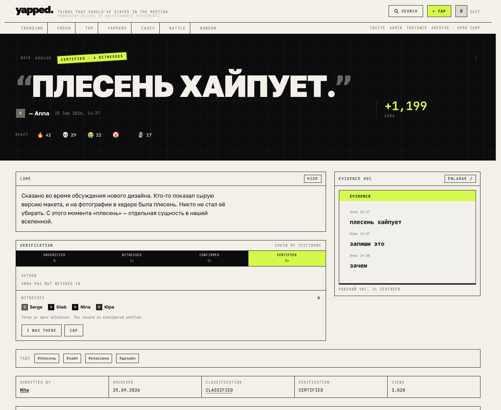
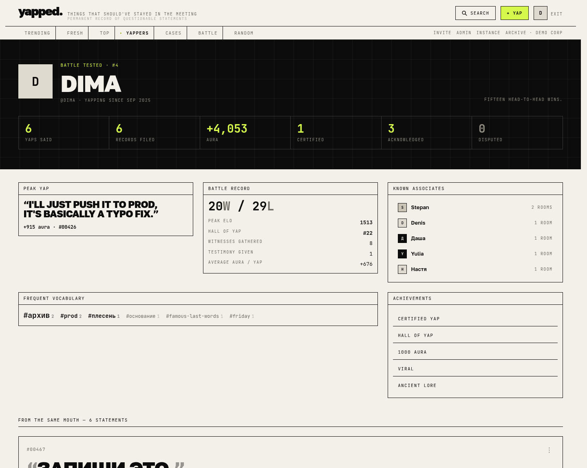
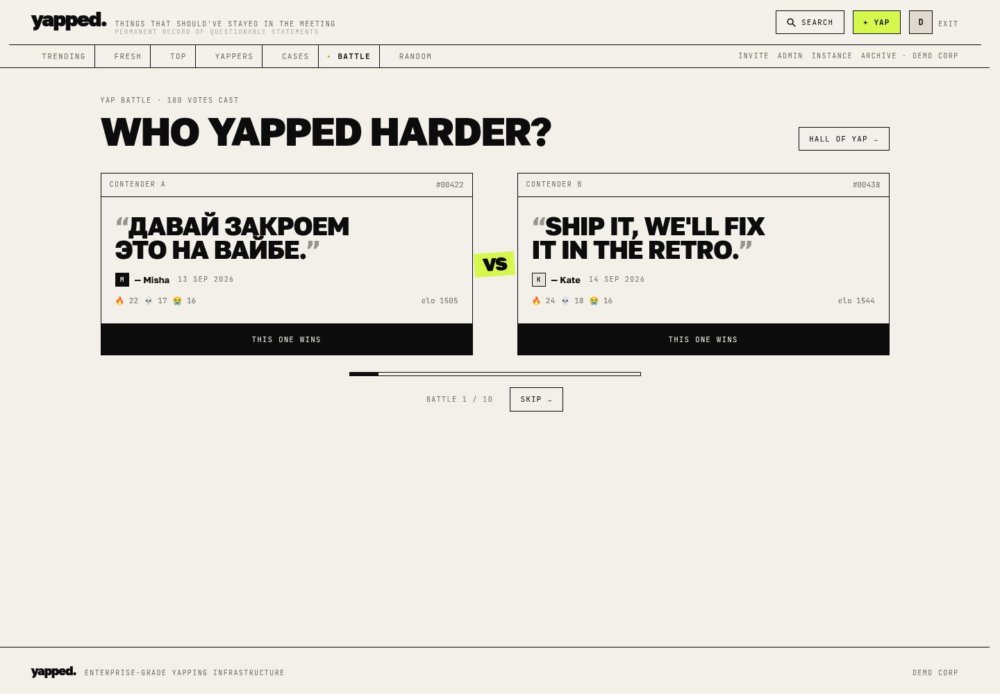
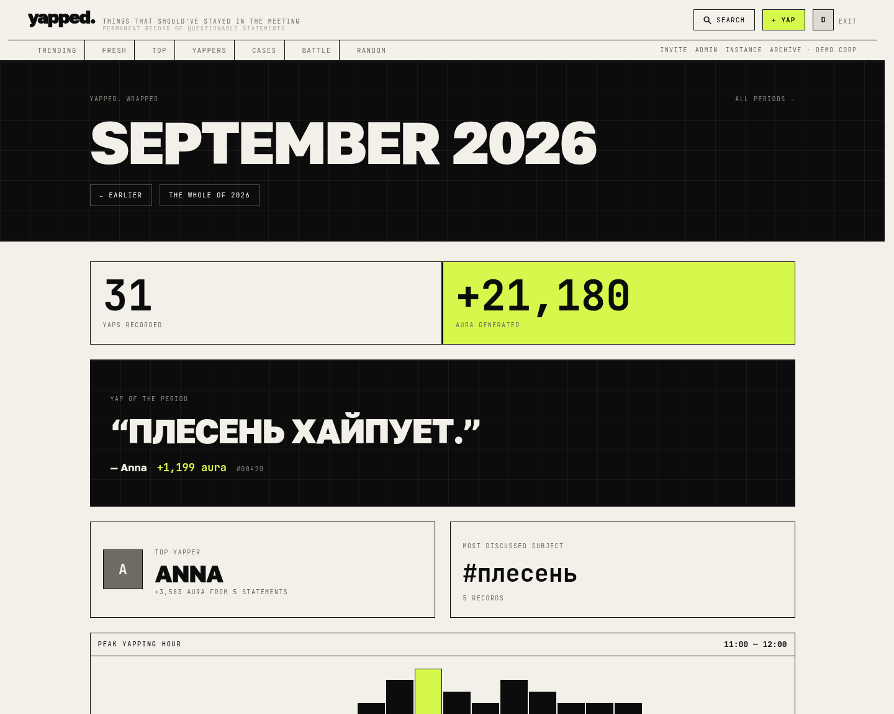
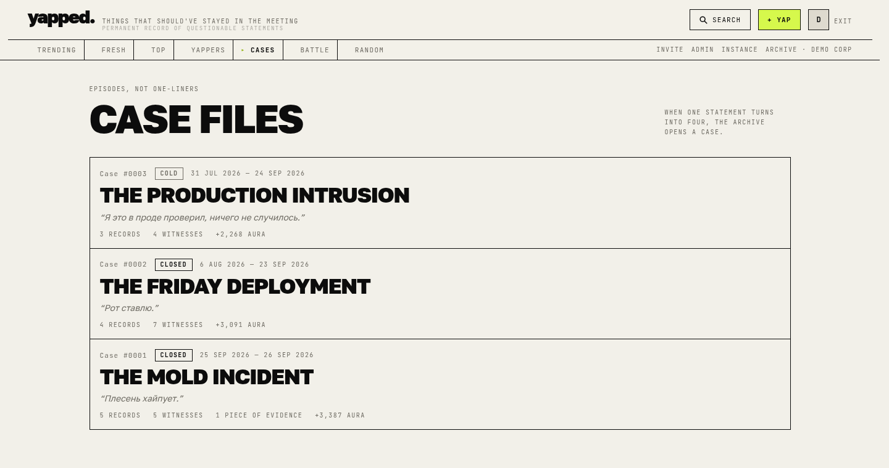
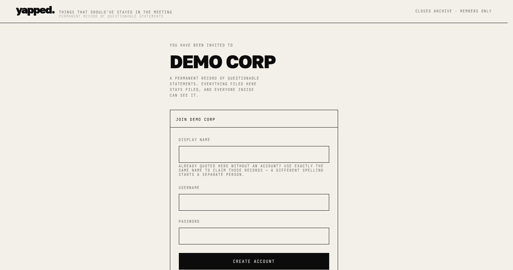
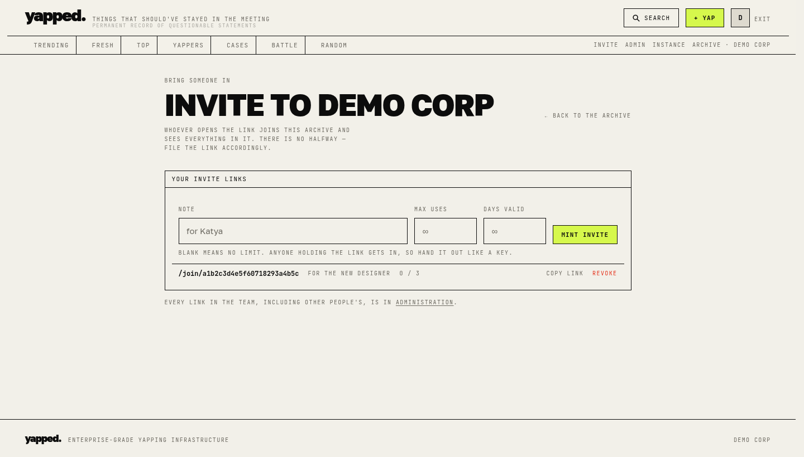
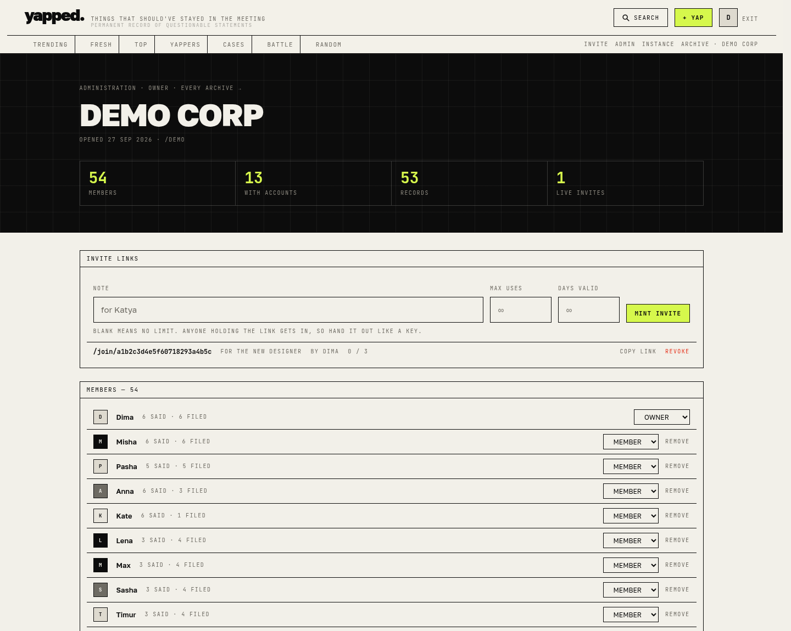
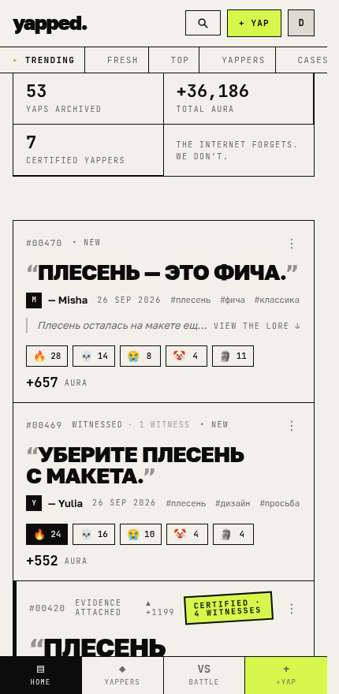

<div align="center">

# yapped.

**things that should've stayed in the meeting**

*enterprise-grade yapping infrastructure*

[](LICENSE)
[](https://github.com/MarvinParanoid/yapped/actions/workflows/ci.yml)


</div>


---

Yapped is a social quote archive for a small team. Someone says something unhinged in a
meeting; you file it; it is permanently on record, reacted to, scored, ranked and occasionally
put in a head-to-head battle with another statement. The joke is that completely unserious
statements are treated with the seriousness of a records-management system.

It is built for **5–15 people and a few quotes a week**, not for scale. That constraint shows
up everywhere: trending decays over sixty days instead of a day, Wrapped refuses to analyse
fewer than ten records, and a count of `3` is presented with the same gravity as a count of
three thousand — because at this size the small numbers *are* the joke.

Bilingual by design — the archive handles Russian and English side by side.

## The idea worth stealing

Three questions about a quote are kept strictly apart, and most of the design falls out of
that separation:

| Question | Answered by | Never confused with |
|---|---|---|
| How hard did the room react? | **aura** — weighted reactions | whether it was really said |
| Will anyone admit it happened? | **verification** — the witness ladder | how funny it was |
| Who said it vs. who filed it? | **author** and **submitter**, stored separately | each other |

The seed deliberately contains a record with 900 aura and **zero** witnesses, because that
gap is the most interesting thing the archive can show you.

## Screens

| | |
|---|---|
|  |  |
| **A record.** Lore, evidence, the verification ladder and the chain of testimony. | **A yapper.** Said vs. filed, battle record, known associates, frequent vocabulary. |
|  |  |
| **Yap battle.** Two quotes, one vote, Elo underneath. | **Wrapped.** The period, quantified after the fact. |
|  |  |
| **Case files.** When one statement turns into four, the archive opens a case. | **Aura market.** Movers, new listings and dormant records. Entirely meaningless. |

<details>
<summary><b>Teams, invites and administration</b></summary>

| | |
|---|---|
|  |  |
| **The only door.** There is no open registration and no anonymous browsing. | **Any member can bring someone in** — not just admins. |
|  |  |
| **Administration.** Invites, members and roles, content moderation. | **On a phone.** |

</details>

## Stack

Next.js 16 (App Router, RSC + Server Actions) · TypeScript · Tailwind CSS v4 · PostgreSQL 17 ·
Prisma 7 · Docker Compose. Session auth with `scrypt`, no third-party identity provider.
Two external UI dependencies (Radix Dialog, sharp); everything else is hand-built.

## Run it locally

You need Node 22+ and a PostgreSQL database.

```bash
npm install
cp .env.example .env          # then set DATABASE_URL
npm run db:migrate            # create the schema
npm run db:seed:demo          # the demo archive — see "Demo vs. real archives"
npm run dev                   # http://localhost:3000
```

**No Postgres installed?** Prisma ships one:

```bash
npx prisma dev --name yapped  # prints a postgres:// URL — put it in .env
```

Also set `DATABASE_POOL_MAX=3` for that one: `prisma dev` is backed by PGlite and
drops connections past a handful of concurrent clients. A real Postgres needs no such limit.

Seeded login: **anna** / **yapped123** — every seeded yapper shares that password, and `dima`
is the instance operator. The login screen says so too, but only on an instance where the demo
archive is actually loaded.

**Starting a real archive instead?** Seed the empty baseline and open the first door by hand:

```bash
npm run db:seed                # inserts nothing, by design
npm run bootstrap              # the first team and its owner — asks four questions
```

The archive is invite-only all the way down: registration needs a link, a link needs a team,
and a team needs a member. That is airtight once an archive exists and unopenable before one
does, so `bootstrap` is the one way in. It refuses to run once any account exists.

## Run it with Docker

```bash
cp .env.example .env
docker compose up --build
```

A one-shot `migrate` service applies migrations (and the demo archive, if asked) before the
app starts; it is built from the `builder` stage so the Prisma CLI has its full dependency
tree. Hand-picking pieces of `node_modules` into the runtime image does not work — it misses
transitive dependencies and fails only at runtime.
**It starts with an empty archive** — no fictional users, no sample quotes. Open the first
door once the stack is up:

```bash
docker compose run --rm migrate npm run bootstrap
```

The `migrate` container, not `app`: the runtime image is a Next standalone build and carries
neither the scripts nor tsx. Uploads live on the `yapped-uploads` volume, the database on
`yapped-db`.

To boot a populated instance for a demo instead: `SEED_MODE=demo docker compose up --build`.

### Deploying to tw-vps (yapped.duckdns.org)

```bash
# on the VPS
git clone <this repo> yapped && cd yapped
printf 'POSTGRES_PASSWORD=%s\nAPP_URL=https://yapped.duckdns.org\nAPP_PORT=3000\n' "$(openssl rand -hex 16)" > .env
docker compose up -d --build
docker compose run --rm migrate npm run bootstrap
```

Then point a reverse proxy (Caddy is one line, nginx is a few) at `127.0.0.1:3000` and
terminate TLS for `yapped.duckdns.org`. The app trusts `APP_URL` for share links, so set it
before the first start. Total footprint fits comfortably on a 1 GB VPS.

## Teams, invites and access

An instance holds one or more **teams**, and a team is an archive: its own records, tags,
cases, leaderboard, battles and Wrapped. Nothing crosses between them.

Access is by invitation only — there is no open registration and no anonymous browsing.

* **The first account** on a fresh instance comes from `npm run bootstrap`, because the rest
  of this list is circular: a link needs a team and a team needs a member. The script creates
  one team and one owner, and refuses once any account exists.
* **Invite links** (`/join/<token>`) are minted at `/invite` by **any member** — bringing
  someone in is not an admin job, and making people ask an owner first just means invites
  stop happening. A member sees and revokes their own links; owners and admins see and
  revoke everyone's from `/admin`. A link can carry a
  note, a maximum number of uses and an expiry; any of those may be left blank for "no
  limit". A link can be revoked by hand at any time. Anyone holding a live link gets in, so
  it is a key, not an announcement.
* **Redeeming** a link either creates an account inside that team, or — if you are already
  signed in — adds your existing account to it. Spending a use is a conditional update, so
  two people opening the last seat at the same moment cannot both take it.
* **Claiming** still works, but only within the team being joined: registering as `Diana`
  takes over an unclaimed `Diana` in *that* archive. Two teams may each quote their own
  Diana and neither can claim the other's.
* **Roles** are `OWNER`, `ADMIN`, `MEMBER`. Owners and admins reach `/admin` — invites,
  member roles and content moderation; only an owner
  (or the instance operator, `User.role = ADMIN`) changes roles or removes people. A team
  always keeps at least one owner. Removing someone revokes access and ends their sessions,
  and deliberately leaves their statements on record — the archive is what was said, not who
  is still around.
* **Switching** teams sets the `yapped_team` cookie; the switcher only appears to people in
  more than one.
* **Opening another archive** on the same instance is an operator decision, taken from
  `/admin/instance` — each team costs storage and shows up in every instance-wide count.

### The instance operator

`User.role = ADMIN` is a separate axis from team roles, and the application deliberately
cannot grant it — only the CLI can:

```bash
npm run grant:admin                     # who holds it
npm run grant:admin -- lesha            # grant
npm run grant:admin -- lesha --revoke   # take it back

# Against a deployed instance, use the `migrate` container: the runtime image is a
# Next standalone build and carries neither the script nor tsx.
docker compose run --rm migrate npm run grant:admin -- lesha
```

It is **not** a superuser over everything. What it adds is the ability to point the team
cookie at *any* archive on the box, including one you are not a member of — without which a
team that loses its last owner is unrecoverable. `/admin/instance` lists every archive and
lets the operator step into one; while they are inside a team they do not belong to, their
role reads `OPERATOR` and a banner says so on every page. That is the only place in the
system where a read crosses a team boundary.

### How the isolation is enforced

`teamId` is a **required argument** of every service function, never an optional filter.
Forgetting it is a compile error rather than a quiet leak, which is why adding teams
produced ~100 type errors and no runtime surprises. `src/lib/auth/team.ts` is the only
place a team id is derived from a request.

Access itself is gated by `requireViewer`, and **where** that call lives matters. A
`loading.tsx` wraps its page in a Suspense boundary, and Next flushes the shell before the
page body runs — so a `redirect()` raised inside such a page arrives as an RSC payload on a
`200`. The browser follows it, but a closed archive has already answered an outsider with a
rendered page. Segments with a `loading.tsx` therefore gate in a `layout.tsx`, which renders
above the boundary; `tests/unit/route-gates.test.ts` fails the build if one forgets.
`src/proxy.ts` sits in front as a cheap fast path for requests with no session cookie at
all — it has no database access, so it cannot recognise an expired one.

Evidence images are gated too: `/api/media/...` checks that the viewer's team holds a record
carrying that key. A content-addressed URL is not a credential.

## Demo vs. real archives

A real Yapped instance starts at zero and accumulates its own lore. Nothing fictional is
ever inserted unless you ask for it:

| | |
|---|---|
| `npm run db:seed` | the production baseline — **inserts nothing**. Every table the app needs is either a Postgres enum or a code catalog, so there is genuinely nothing to create. |
| `npm run db:seed:demo` | the demo archive, filed under one team (`Demo Corp`): 14 yappers, 40 colleagues, 46 bilingual quotes, ~3,000 reactions, 84 witness statements across all four verification rungs, 3 formally disputed records, evidence images and 180 battles. |

The split is by **seed strategy, not by a runtime flag** — there is no `is_demo` column, so
no query, leaderboard, count or battle ever has to filter demo rows out.

The demo seed refuses to run against a database holding anyone outside its own cast, so a
stray command cannot wipe a real archive (`SEED_FORCE=true` overrides). It is also
deterministic and deliberately covers every UI state — unverified through certified, disputed,
evidence, lore, high and low aura, full battle history — which makes it the visual regression
fixture as well as the demo.

An empty instance is a designed state, not a broken one: the feed shows a first-run panel,
the first record is assigned `#00001`, and every page has its own empty copy.

## Where things live

```
docs/ARCHITECTURE.md     the plan: schema, routes, component tree, design tokens
prisma/schema.prisma     users, yaps, reactions, tags, evidence, battles, achievements
prisma/seed.ts           seed entry point — dispatches on SEED_MODE
prisma/seed/base.ts      production baseline (deliberately empty)
prisma/seed/demo.ts      the deterministic demo archive / regression fixture
src/proxy.ts             closes the archive to anonymous requests before a page renders
src/app/                 routes; actions.ts holds every Server Action
src/app/join/[token]/    the invite landing page
src/app/invite/          mint an invite link — any member
src/app/admin/           every link, members, content moderation, team settings
src/lib/auth/team.ts     resolves the viewer and their active team (the only source of teamId)
src/lib/services/teams.ts    members, roles, team creation
src/lib/services/invites.ts  minting, inspecting, spending and revoking links
src/components/          presentation only — no Prisma, no SQL, no ranking math
src/lib/services/        business logic; the only place that touches the database
src/lib/ranking/aura.ts  the aura formula
src/lib/ranking/elo.ts   battle ratings
src/lib/storage/         StorageDriver abstraction (local filesystem today, S3 later)
src/lib/achievements.ts  the badge catalog
```

## Changing the parts you will want to change

**Aura market / momentum** — `src/lib/services/aura-history.ts`. Aura at any past moment, the
movement between two moments, and the archive-wide index. Shared by `/market`, the Trending
indicator and On this day.

**On this day** — `src/lib/services/on-this-day.ts`. Same calendar date in earlier years, with
aura reconstructed as it stood back then from reaction timestamps.

**Wrapped** — `src/lib/services/wrapped.ts`. Monthly and yearly reports, derived on read from
existing timestamps — no snapshot tables, so any past period can be opened at any time.

**Cases** — `src/lib/services/cases.ts`. Grouping records into a documented episode. Member
order is always derived from when things were said, so filing a record into a case re-sequences
it automatically.

**Search qualifiers** — `src/lib/search.ts`. `from:` `by:` `tag:` `aura:>500` `status:certified`
`has:evidence` `before:` `after:` `case:`, plus free text. Adding one is an entry in the parser
and a clause in `buildWhere`.

**The verification ladder** — `src/lib/verification.ts`. How many colleagues have to press
*I was there* before a record becomes WITNESSED, CONFIRMED or CERTIFIED, and how many denials
make it DISPUTED. Aura never certifies anything; only witnesses do.

**The aura formula** — `src/lib/ranking/aura.ts`. Reaction weights, the trending decay and the
certification threshold are exported constants. Nothing outside that file knows the maths.

**Battle ratings** — `src/lib/ranking/elo.ts`. Every vote is journalled in the `Battle` table
with the ratings before it, so a new algorithm can be replayed over the full history
(`replay()` is already there).

**Achievements** — add an entry to `ACHIEVEMENTS` in `src/lib/achievements.ts` with a predicate
over `YapperStats`. No migration, no UI change.

**Image storage** — implement `StorageDriver` (`src/lib/storage/types.ts`) in an `s3.ts`, return
it from `storage()` when `STORAGE_DRIVER=s3`. Files never touch the database; only the key does.

## Built for a small archive

This is a record for a handful of people, not a feed. A few statements a week, sometimes none.
Trending reaches back 60 days and ranks by decay rather than using a hard window; Wrapped only
produces a full report above 10 records and otherwise says something dry; On this day matches
±7 days; certification needs 3 witnesses, not 30. Small absolute numbers are shown as they are
and surrounded by unreasonably serious analytics — four colleagues pressing an emoji is the
joke, so the archive does not hide it.

## A development gotcha

The Prisma client is cached on `globalThis` so it survives hot reload — which means after a
schema change you must **restart `next dev`**, not just re-run `prisma generate`. A running dev
server otherwise keeps the old client and you get `Cannot read properties of undefined` or
`Unknown field` errors that look like schema bugs.

## Tests

```bash
npm run test:unit    # pure modules, no database, ~100ms
npm test             # everything (service tests need TEST_DATABASE_URL)
```

Two layers on `node:test` via `tsx` — no extra runner, no browser, no new dependencies. See
[tests/README.md](tests/README.md) for what each layer protects and how to point the service
tests at a throwaway database. CI runs typecheck, both layers and a build on every push.

## Scripts

| | |
|---|---|
| `npm run dev` | development server |
| `npm run build` / `start` | production build and server |
| `npm run typecheck` | TypeScript, no emit |
| `npm test` | unit + service tests |
| `npm run test:unit` | pure-module tests only |
| `npm run db:migrate` | create and apply a migration |
| `npm run db:deploy` | apply migrations (production) |
| `npm run db:seed` | production baseline (inserts nothing) |
| `npm run db:seed:demo` | load the fictional demo archive |
| `npm run db:reset` | drop, migrate and reseed |
| `npm run db:studio` | browse the data |
| `npm run bootstrap` | the first team and owner on an empty instance |
| `npm run grant:admin` | list instance operators |
| `npm run grant:admin -- <username>` | grant the instance role (`--revoke` takes it back) |

## Environment

| Variable | Default | Notes |
|---|---|---|
| `DATABASE_URL` | — | required |
| `DATABASE_POOL_MAX` | `10` | connection pool ceiling; requests queue once reached. Set to `3` when using `npx prisma dev`, whose PGlite backend refuses more than a few concurrent connections. |
| `APP_URL` | `http://localhost:3000` | public origin, used for share links |
| `STORAGE_DRIVER` | `local` | `local` or `s3` |
| `STORAGE_LOCAL_DIR` | `./var/uploads` | evidence files, kept outside the database. **Use an absolute path in production** — the standalone server runs from `.next/standalone`, so a relative path lands in the wrong place. Docker already sets `/app/var/uploads`. |

## Continuous integration

The same checks run on both forges, in the same order — typecheck, unit tests, service tests
against a real Postgres, then a production build:

* GitHub Actions — [`.github/workflows/ci.yml`](.github/workflows/ci.yml)
* GitLab CI — [`.gitlab-ci.yml`](.gitlab-ci.yml)

## Contributing

It is a small project with opinions. Two worth knowing before you open a pull request:

* **`teamId` is a required argument, never an optional filter.** If you add a service
  function that reads or writes archive data, it takes the team explicitly — forgetting it
  should be a compile error, not a quiet leak.
* **Comments explain *why*, not *what*.** Most of the ones in this codebase exist because
  something was surprising, was argued about, or shipped broken once.

Run `npm test` before pushing; `tests/README.md` explains what each layer protects and how to
point the service tests at a throwaway database.

## License

[MIT](LICENSE) © Aleksei

The screenshots above are from the demo archive (`npm run db:seed:demo`) — every person and
every quote in them is fictional.

---

*the internet forgets. we don't.*
